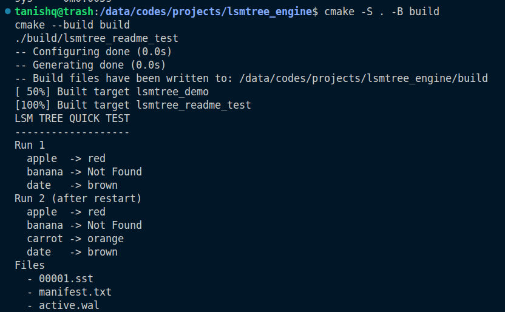

# LSM-Tree Key-Value Storage Engine

A simplified, single-threaded key-value storage engine in C++ based on core LSM-Tree ideas.

This project was built to show a clear understanding of how modern storage engines handle writes, reads, recovery, and on-disk data organization. The implementation is intentionally simple and educational, but it still includes the main building blocks that make an LSM-based design work.

## What This Project Shows

- sorted in-memory writes using a `MemTable`
- durable writes using a `Write-Ahead Log (WAL)`
- flushing in-memory data to disk as immutable `SSTable` files
- point lookups across memory and disk
- delete handling through tombstones
- Bloom Filter based SSTable skipping
- basic size-tiered compaction
- recovery after restart by replaying the WAL

## Design Overview

### Write Path

For each write:

1. append the operation to the WAL
2. update the in-memory MemTable
3. flush the MemTable to a new SSTable when it reaches a small threshold

This keeps writes durable while also making them fast and simple.

### Read Path

For each read:

1. check the MemTable first
2. if not found, check SSTables from newest to oldest
3. use the Bloom Filter to skip SSTables that definitely do not contain the key
4. use the SSTable index to seek to the correct record offset

### Delete Handling

Deletes are stored as tombstones instead of removing data immediately. During compaction, older values are dropped and tombstoned keys can be removed from the final merged output.

### Recovery

On startup, the engine:

1. loads the manifest file
2. restores the active SSTable list
3. replays the WAL
4. rebuilds the MemTable state in memory

## Project Structure

```text
include/
  memtable.h
  wal.h
  sstable.h
  bloom_filter.h
  lsm_engine.h

src/
  memtable.cpp
  wal.cpp
  sstable.cpp
  bloom_filter.cpp
  lsm_engine.cpp
  main.cpp
  small_test.cpp
```

## Build

From the project root:

```bash
cmake -S . -B build
cmake --build build
```

## Run

### Full Demo

This runs the full end-to-end flow with multiple writes, flushes, compactions, crash simulation, and recovery:

```bash
./build/lsmtree_demo
```

### Small Test

This runs a short, clean test with compact output:

```bash
./build/lsmtree_small_test
```

## Sample Output



## Key Files

- `src/lsm_engine.cpp`  
  Main engine logic for reads, writes, flushing, recovery, and compaction.

- `src/sstable.cpp`  
  SSTable file format, index loading, record lookup, and full-file scan for compaction.

- `src/wal.cpp`  
  WAL append and replay logic.

- `src/bloom_filter.cpp`  
  Simple Bloom Filter implementation used before SSTable lookups.

- `src/main.cpp`  
  Larger end-to-end demo run.

- `src/small_test.cpp`  
  Short verification run with compact terminal output.

## Current Scope

This is a focused educational implementation, so a few things are intentionally kept simple:

- single-threaded execution
- plain manifest format
- basic size-tiered compaction
- no range scan support
- no block cache
- no checksums
- no multi-level compaction strategy

## Possible Next Steps

- add timing and throughput metrics
- support range scans
- add checksums for file validation
- support command-line configuration
- extend compaction into multiple levels
